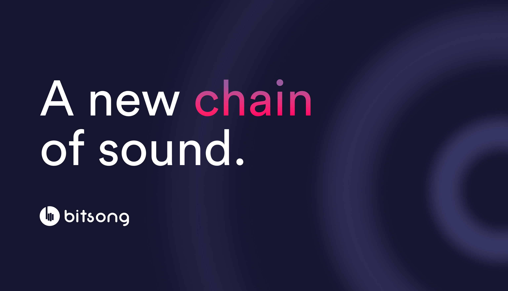

<p></p>

[](https://github.com/Nephirim/go-fanfury/blob/master/LICENSE)

# Introduction

## What is FanFury?

FanFury is a multifunctional blockchain-based ecosystem built to empower the music industry. It unites artists, fans, distributors in an environment where music, merchandise, and fan loyalty are assets of value. FanFury’s decentralized ecosystem of services providers the global music community with a trustless marketplace for music streaming, Fan Tokens, and NFTs, powered by the FURY token.

## Brief History of FanFury

FanFury was conceived in 2018 by developer and entrepreneur Angelo Recca. Angelo realized that while the digitalization of music has brought many benefits to the industry, it’s also created a new set of problems around the ownership of music and attribution of royalties. He joined forces with Iulian Anghelin and FanFury was born.
The initial intention was for FanFury to become an Ethereum-based application where fans could stream music and artists could receive royalties directly. However, after discovering Cosmos and its ambition to become the “Internet of Blockchains,” Angelo and Iulian immediately recognized the full potential of becoming part of a multi-chain environment.
After launching the main FanFury blockchain in August 2020, the fanfury-2b mainnet went live on October 21, 2021. Featuring Fan Tokens, NFTs, and music streaming platform, all underpinned by secure, robust, battle-tested blockchain technology, the launch of FanFury marks a turning point in the ongoing development of the music industry.

_NOTE: This is alpha software. Please contact us if you aim to run it in production._

**Note**: Requires [Go 1.19.x+](https://golang.org/dl/)

# Install FanFury Blockchain

There are many ways you can install FanFury Blockchain Testnet node on your machine.

## From Source
1. **Install Go** 
    ```bash
    wget -q -O - https://git.io/vQhTU | bash -s -- --remove
    wget -q -O - https://git.io/vQhTU | bash -s -- --version 1.19.5
    ```
2. **Clone FanFury source code to your machine**
    ```bash
    git clone https://github.com/Nephirim/go-fanfury.git
    cd go-fanfury
    ```
  3. **Compile**
		```bash
		# Install the app into your $GOBIN
		make install
		# Now you should be able to run the following commands:
		fanfuryd help
		```
		The latest `go-fanfury version` is now installed.
3. **Run FanFury**
	```bash
	fanfuryd start
	```

## Running the test network and using the commands

To initialize configuration and a `genesis.json` file for your application and an account for the transactions, start by running:

>  _*NOTE*_: In the below commands addresses are are pulled using terminal utilities. You can also just input the raw strings saved from creating keys, shown below. The commands require [`jq`](https://stedolan.github.io/jq/download/) to be installed on your machine.

>  _*NOTE*_: If you have run the tutorial before, you can start from scratch with a `fanfuryd unsafe-reset-all` or by deleting both of the home folders `rm -rf ~/.fanfury*`

```bash
# Initialize configuration files and genesis file
fanfuryd init MyValidator --chain-id fanfury-localnet

# Copy the `Address` output here and save it for later use
# [optional] add "--ledger" at the end to use a Ledger Nano S
fanfuryd keys add jack

# Add both accounts, with coins to the genesis file
fanfuryd add-genesis-account jack 100000000000ufury --keyring-backend test

# Generate the transaction that creates your validator
fanfuryd gentx jack 10000000ufury --keyring-backend test

# Add the generated bonding transaction to the genesis file
fanfuryd collect-gentxs
fanfuryd validate-genesis

# Now its safe to start `fanfuryd`
fanfuryd start
```

You can now start `fanfuryd` by calling `fanfuryd start`. You will see logs begin streaming that represent blocks being produced, this will take a couple of seconds.

## Resources
- [Official Website](https://fanfury.io)

## Decentralized Exchanges
- [Osmosis ATOM/FURY](https://app.osmosis.zone/?from=ATOM&to=FURY)
- [Osmosis OSMO/FURY](https://app.osmosis.zone/?from=OSMO&to=FURY)

### Community
- [Discord](https://discord.gg/mZC9Yk3)
- [Twitter](https://twitter.com/Nephirim)
- [Telegram Channel (English)](https://t.me/Nephirim)
- [Medium](https://medium.com/@Nephirim)
- [Reddit](https://www.reddit.com/r/fanfury/)
- [Facebook](https://www.facebook.com/Nephirim)
- [BitcoinTalk ANN](https://bitcointalk.org/index.php?topic=2850943)
- [Linkedin](https://www.linkedin.com/company/fanfury)
- [Instagram](https://www.instagram.com/fanfury_official/)

## License

APACHE 2.0

## Versioning

### SemVer

FanFury uses [SemVer](http://semver.org/) to determine when and how the version changes.
According to SemVer, anything in the public API can change at any time before version 1.0.0

To provide some stability to FanFury users in these 0.X.X days, the MINOR version is used
to signal breaking changes across a subset of the total public API. This subset includes all
interfaces exposed to other processes, but does not include the in-process Go APIs.
